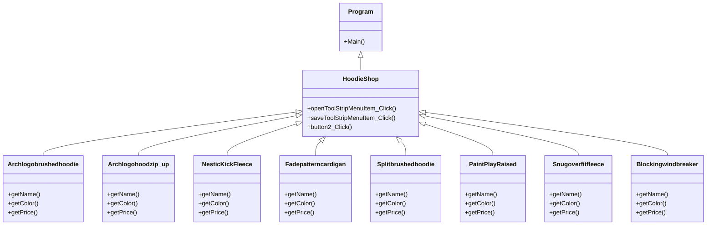

# finalproject
projectfinal
###ความเป็นมาของโปรแกรม
-

###วัตถุประสงค์ของโปรแกรม
-

###โครงสร้างของโปรแกรม (Class diagram) ของโปรแกรม
-

###ชื่อของผู้พัฒนาโปรแกรม
-นายวิชญ์พล ยืนยง 653450103-3
# FinalProject

### ความเป็นมาของโปรแกรม
=เนื่องจากการบันทึกข้อมูล และการเก็บข้อมูลไม่เป็นสัดส่วน ทำให้บางครั้งสินค้าตกหล่น เลยคิดโปรแกรมนี้ขึ้นมาเพื่อตอบสนองของผู้ใช้ที่เป็นพ่อค้าเเม่ค้าออนไลน์ เพื่อให้การเช็คออร์เดอร์ง่ายขึ้น

### วัตถุประสงค์ของโปรแกรม
=บันทึกข้อมูลของสินค้า

### โครงสร้างของโปรแกรม (Class diagram)

### ชื่อของผู้พัฒนาโปรแกรม
643450320-4 กฤติยา สินโพธิ์
